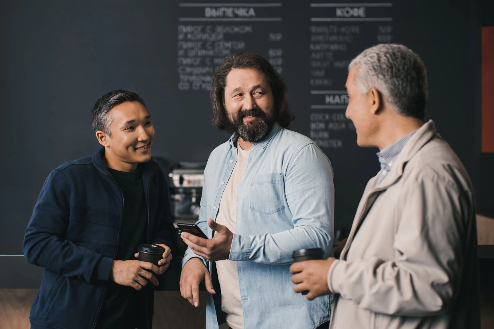
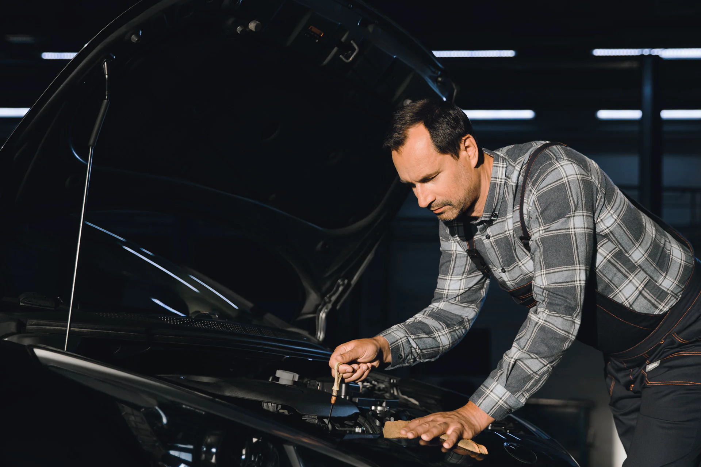
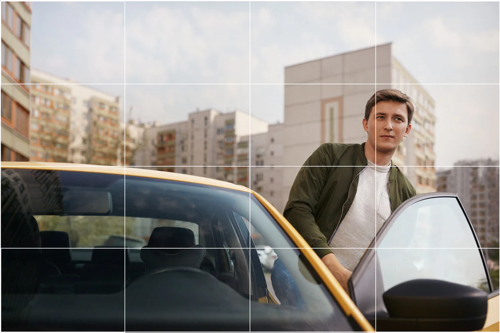
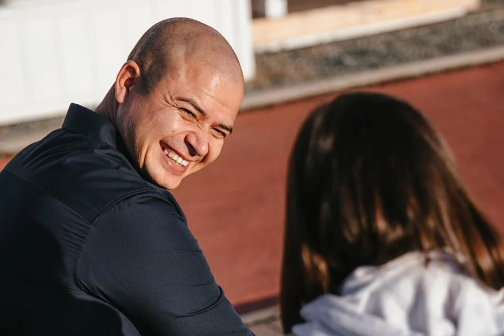
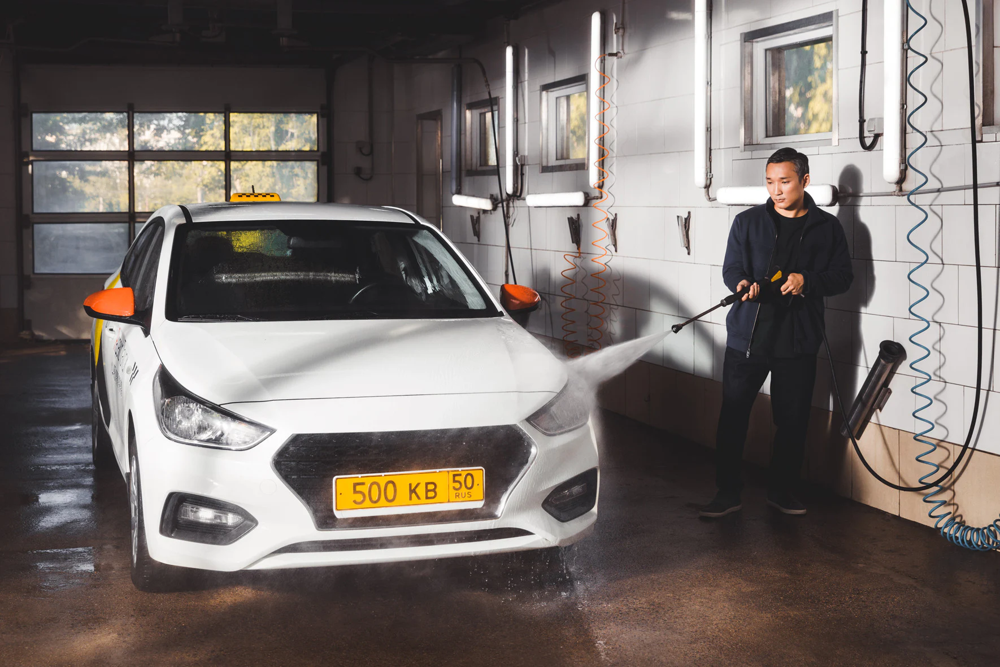

# Рекомендации

## Герои

Наши герои — реальные люди со своей культурой, опытом и мировоззрением. Они разные.

## Локации

Место подчеркивает сюжет, помогает рассказать историю. Герой находится там не случайно и взаимодействует со средой. Пространство обжито и подчинено ему.

Но локация второстепенна, она не должна отвлекать нас от действий героя. Фон не должен подавлять визуально и по смыслу. Поэтому мы не снимаем на фоне известных туристических мест.


Избегайте статичных кадров без явного сюжета и взаимодействия



Активный фон отвлекает внимание


## Ракурс

Мы не смотрим свысока: предпочитаем прямой ракурс, на уровне глаз, чтобы находиться с героем на одном уровне и сохранять человеческий взгляд. Такой ракурс сохраняет целостность макета и рифмуется с горизонталями колорблока.

На город или объекты мы можем смотреть сверху, чтобы увидеть их такими, какие они есть. Ещё это дает возможность посмотреть на объект с другой, непривычной стороны.


Избегайте вынужденных перспектив, которые пытаются добавить интерес к сюжетам



Избегайте перспектив, которые не находятся над головой, или на уровне глаз


## Композиция

Организовывайте кадр с помощью сетки 4 на 4: это даёт возможность построить кадр для кропа под любой формат. Не забывайте про воздух в кадре: это определяет и подчеркивает основной предмет фотографии, притягивая к нему ваш взгляд. А еще это может быть пространством для текста.


Избегайте отстутствия точки интереса и привлечения внимания к пустому центру



Избегайте конфликтующих точек фокуса и отсутствия сеток в композиции


## Свет

Мы не можем воссоздать реальность лучше, чем она есть. Поэтому стараемся использовать натуральное освещение — оно привычнее и проще воспринимается. Следите, чтобы не было бликов, засветов и черных пятен.


Избегайте солнечных бликов, засветов, череcчур контрастных цветов


## Резкость

Сохраняйте планы резкими. Так они создают контекст, в котором находится герой, происходит история, находится деталь. Детали имеют значение, мы не хотим ими пренебрегать.


Не используйте софт-фокус



Избегайте эффекта макро при съемке деталей


## Ретушь

Сохраняйте натуральный баланс белого. Следите за натуральностью тона кожи, она не должна уходить в желтизну или выглядеть слишком бледной. Ретушь должна быть минимальной, не стоит добавлять эффектов.


Избегайте блёклых цветов и очевидной цветокоррекции/фильтров, а также виньетирования


## Чек-лист

1. водитель и пассажиры пристегнуты
2. нет сторонних брендов
3. в кадре нет церквей
4. нельзя использовать сторонние логотипы

